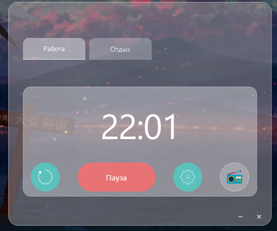

# Pomodoro Timer


🎉 Встречаем новый год с продуктивностью и хорошим настроением!



Простой и элегантный таймер помодоро с современным интерфейсом и встроенным радио.

> ⚠️ **Важно:** Этот проект создан в развлекательных и образовательных целях. Он не предназначен для использования в производственной среде. Для использования в продакшене необходимо реализовать дополнительную защиту и обработку ошибок.

## Возможности

- Таймер для работы и отдыха
- Встроенное радио для приятной работы
- Настройка продолжительности интервалов
- Системные уведомления
- Минимизация в системный трей
- Современный интерфейс с эффектами glassmorphism

## Установка

1. Клонируйте репозиторий
2. Установите зависимости:
   ```
   pip install -r requirements.txt
   ```
3. Запустите приложение:
   ```
   python main.py
   ```

## Структура проекта

```
Pomidorro/
├── src/                    # Исходный код
│   ├── core/              # Основная логика
│   │   ├── timer.py       # Логика таймера
│   │   └── radio.py       # Логика радио
│   ├── ui/                # Пользовательский интерфейс
│   │   ├── main_window.py # Главное окно
│   │   ├── timer_widget.py # Виджет таймера
│   │   ├── radio_widget.py # Виджет радио
│   │   └── settings_widget.py # Виджет настроек
│   └── styles/            # Стили
│       └── style.py       # Стили приложения
├── resources/             # Ресурсы
│   └── icons/             # Иконки
├── publish/               # Скриншоты и материалы для публикации
│   └── main_window.png    # Главное окно приложения
├── main.py               # Точка входа
└── requirements.txt      # Зависимости
```

## Требования

- Python 3.8 или выше
- Операционная система: Windows, macOS или Linux

## Использование

1. Нажмите "Старт" для запуска таймера
2. Используйте кнопку "Настройки" для изменения продолжительности интервалов
3. Переключайтесь между режимами "Работа" и "Отдых" с помощью вкладок
4. Включите радио через кнопку "Радио" для приятной работы под музыку
5. Таймер можно свернуть в системный трей

## Разработка с ИИ-помощником

Проект был построен при содействии CodeGeeX (версия 2.0) - ИИ-помощника по программированию от команды Z.ai.

## Вклад в проект

Мы приветствуем вклад в развитие проекта! Если у вас есть идеи по улучшению или вы хотите добавить новый функционал, не стесняйтесь создавать issue или отправлять pull requests. Особенно ценно:
- Улучшения пользовательского интерфейса
- Новые радиостанции
- Дополнительные настройки таймера
- Исправление ошибок

## Лицензия

MIT